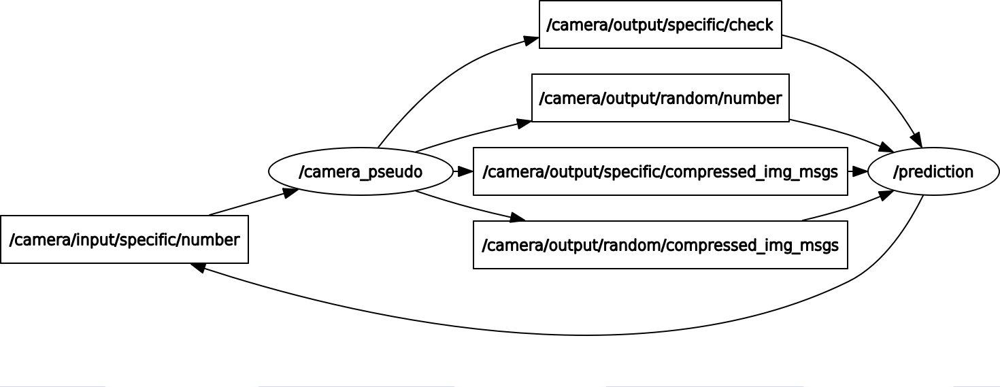

# Lösung der ersten Aufgabe


##  Erstellung eines Keras Models 

Für das Keras 3 Convolutional Layer + 4 FullyConnected Layer (mit DropOut und Batch Normalisierung verwendet).

```python
num_classes=10
num_filters = 64
num_dense_neurons = 64

tf.keras.models.Sequential([
    layers.Conv2D(filters=num_filters, kernel_size=5, input_shape=(28, 28, 1)),
    layers.BatchNormalization(),
    layers.Activation('relu'),

    layers.Conv2D(filters=num_filters, kernel_size=5),
    layers.BatchNormalization(),
    layers.Activation('relu'),

    layers.Conv2D(filters=num_filters, kernel_size=5),
    layers.BatchNormalization(),
    layers.Activation('relu'),

    layers.Flatten(),

    layers.Dense(num_dense_neurons),
    layers.BatchNormalization(),
    layers.Activation('relu'),
    layers.Dropout(0.25),

    layers.Dense(num_dense_neurons),
    layers.BatchNormalization(),
    layers.Activation('relu'),
    layers.Dropout(0.25),

    layers.Dense(num_dense_neurons),
    layers.BatchNormalization(),
    layers.Activation('relu'),
    layers.Dropout(0.25),

    layers.Dense(num_classes),
    layers.BatchNormalization(),
    layers.Activation('softmax')
])
```

Das wichtigste, worauf zu achten ist, ist das der `input_shape` (`input_dim` ist auch möglich) mit der Größe der
MNIST Bilder (28 * 28 px) übereinstimmt. Und das die Größe des Output Layers mit der Anzahl der Klassen (10) des MNIST Datensatzes 
übereinstimmt.

Das Model habe ich einige Zeit mit dem in Keras enthaltenen MNIST Datensatz trainieren lassen.
`train.py` ist das Trainingsscript zum fortsetzen / wiederholen des Trainings.

Nach einer gewissen Trainingszet Zeit ergab sich eine Accuracy 99,44 % auf dem Evaluation-Datensatz.
Das Model ist in der Datei `model.h5` abgespeichert und kann über die Datei `evaluate.py` überprüft werden.

## Kommunikation zwischen Rosnodes.

Um die Aufgabe zu lösen auf ich 4 Rosnodes erstellt. 4 Subscriber und 1 Publisher.

### Subscriber: subscribe_specific_image & Publisher: publish_specific_number

Subscript sich auf das `/camera/output/specific/compressed_img_msgs` Topic.
Dort emfängt er ein voreingestelltes Bild, das Bild ist immer das gleiche. Dieses wird mit `cv_bridge` in einen 28 * 28 * 1 px Vektor von Pixelwerten umgewandelt.
Diesem Vektor wird eine Batch-Dimension hinzugefügt um den Anforderungen von Keras zu entsprechen.
Danach der Vektor durch `model.predict()` eine Vorhersage gemacht, welche Zahl auf dem Bild zu sehen ist.
Diese Vorhersage wird `/camera/input/specific/number` gepublisht.

### Subscriber: subscribe_specific_check

Subscript sich auf das `/camera/output/specific/check` Topic. Dort emfängt es ob die zuvor vom `publish_specific_number`
gepublishte Vorhersage korrekt war.

### Subscriber: subscribe_random_image

Subscript sich auf das `/camera/output/random/compressed_img_msgs` Topic. Dort wird jedes mal ein zufälliges Bild
aus dem MNIST-Datensatz empfangen. Von diesem wird, wie vorher bei **subscribe_specific_image**, durch das zuvor trainierte
Keras Model, berechnet welche Zahl auf dem Bild zu sehen ist.

### Subscriber: subscribe_random_number

Subscript sich auf das `/camera/output/random/number` Topic. Emfängt die wirkliche Zahl die auf dem zufälligen Bild zu sehen ist.
So kann man überprüfen ob das Keras Model die richtige Prediction gemacht hat.

### RQT Graph

